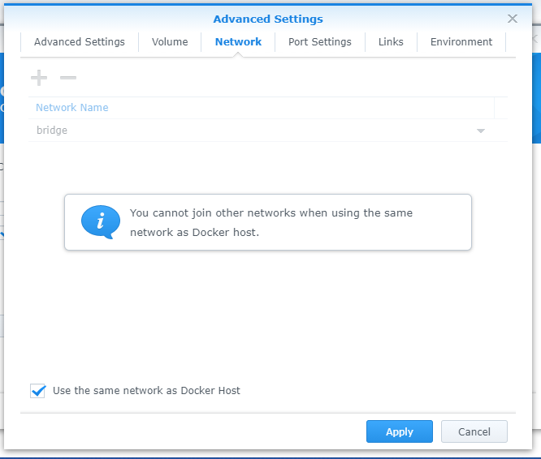

 
# docker-twonkyserver
[TwonkyMedia server (TMS)](http://twonky.com/) is DLNA-compliant UPnP AV server software from PacketVideo. It runs on Linux, Mac OS X, Windows XP, Windows Vista, Windows Home Server, and Windows 7 computers as well as Android, iOS, and other mobile platforms. TwonkyMedia server can be used to share and stream media to most UPnP AV or DLNA-compliant clients, in addition to non-UPnP devices through the HTML, RSS, and JSON supported front ends.
There are two docker images:

* Without ffmpeg
* Including ffmpeg.  Builds are static and pulled from [johnvansickle](https://johnvansickle.com/ffmpeg/).

The docker image is based on a very minimal Ubuntu Focal.

You will need a valid licence to run the TwonkyMedia server inside this docker image.  This can be purchased from https://twonky.com/  There is a 30 day trial available.

## Usage - Docker CLI

```
docker run -d --net=host --name=twonkyserver -v /path/to/config:/config:rw -v /path/to/data:/data:ro -v /etc/localtime:/etc/localtime:ro dtjs48jkt/twonkyserver
```

After starting the docker container go to:

http://server:9000/webconfig

## Update Functionality
This docker image is based on Ubuntu. On each start of the container an update of the used Ubuntu packages is performed. Due to the running update it might take a little longer until the application TwonkyMedia server is available.

## Parameters
* `-v /config` - Where TwonkyMedia server stores its config files
* `-v /data` - Where TwonkyMedia server will find the media to share via DLNA
* `-v /etc/localtime` - Set to use the corect time setting with TwonkyMedia server 
* `-e GROUP_ID` for GroupID - see below for explanation
* `--net=host` Used to DLNA communication in the network

### User / Group Identifiers

Sometimes when using data volumes (`-v` flags) permissions issues can arise between the host OS and the container. To avoid this issue you are allowed to specify the group `GROUP_ID`. Ensure the data volume directory on the host is owned by the same group you specify.


## Usage - Synology Docker

You can find these Docker images using Docker on Synology, in the Docker Registry, search for "mgillespie/twonkyserver_lynx"  and select a tag 'latest' (with ffmpeg)  or 'latest-noffmpeg'

For configuration, select Advanced Settings.  It's recommended to limit resources, especially if using ffmpeg bundled build.


You should map your media folders from your NAS to be accessible within the image.


On the Ports tab, it's recommended to use the same network as docker host.



These builds are tested on DS220+

## Versions

+ **13.09.2017:** Initial release. Using phusion 0.9.22, TwonkyMedia server 8.4.1 and ffmpeg 3.3.4
+ **20.09.2017:** Permission fix. Contains phusion 0.9.22, TwonkyMedia server 8.4.1 and ffmpeg 3.3.4
+ **24.10.2017:** Added auto update functionality. Contains phusion 0.9.22, TwonkyMedia server 8.4.1 and ffmpeg 3.3.4
+ **24.11.2017:** Update to phusion 0.9.22, TwonkyMedia server 8.5 and ffmpeg 3.4
+ **02.09.2018:** Update to TwonkyMedia server 8.5.1 and ffmpeg 4.0.2
+ **07.09.2019:** Update to TwonkyMedia server 8.5.1 and ffmpeg 4.2.1 / changed base image to Ubuntu Bionic (fixed update problems with phusion)
+ **06.08.2029:** Forked from H2CK/twonkyserver, updated to Ubuntu focal, added some flags to help with running on low resource NAS devices to try and prevent non responsive server after a few weeks.
+ **21.11.2020:** Made branch without ffmpeg, added some notes about running on Synology